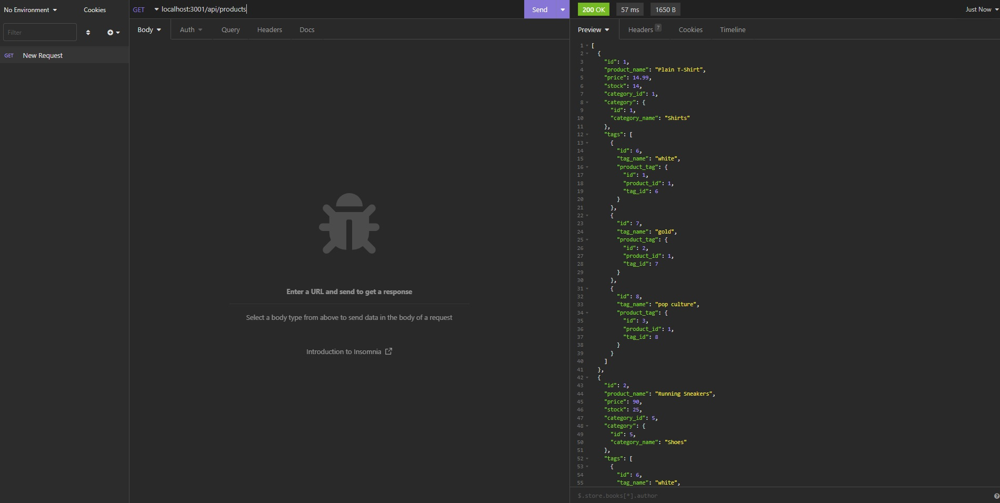

# Shop-QL

This application is a rest API created with a MySql database that is designed for an ecommerce site. It is designed to organize products into categories, and track them with tags. Data is structured into usable objects using Sequelize.

